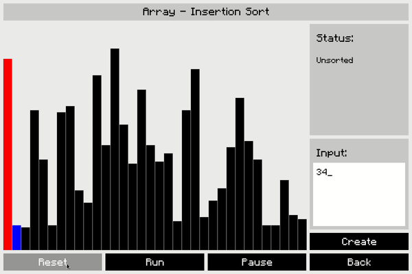
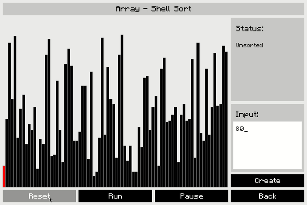
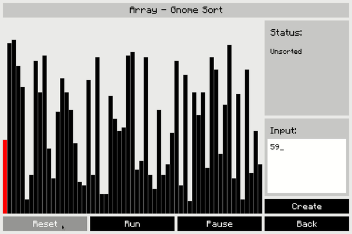
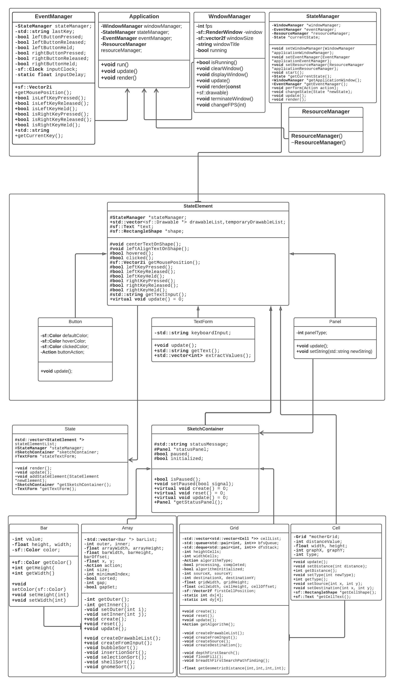

# AlgoSketch
 

## Algorithm Showcase
### Flood fill in 2D grid

### Pathfinding with BFS in 2D grid

### Insertion Sort

### Shell Sort

### Gnome Sort

## Features
- Custom sized array and 2D grid visualization
- 5 sorting algorithms and 3 grid algorithms visualization
- Control the speed of the algorithms
- Pause and resume to check current status

## Guide
- [How to build](/build/BUILD.md)
- [How to run](/bin/BIN.md)

## Bugs
- Speed is controlled by editing FPS, which causes UI lag
- Larger data structures cause memory usage spike and lag

## Missing Features
- Custom graph creation
- Tree like data structures
- Graph and tree algorithms

## UML

