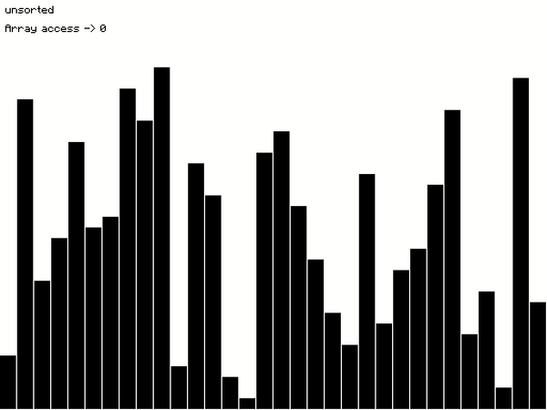
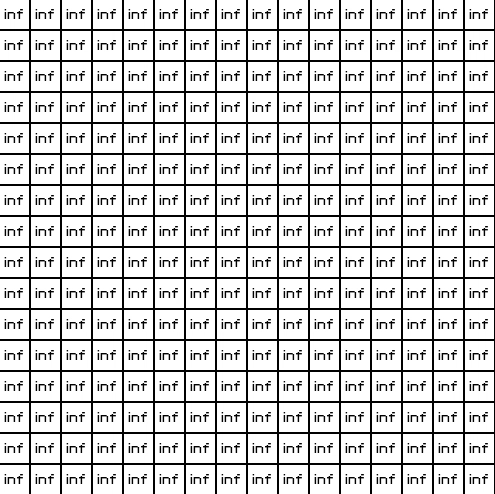

# Algo++
(Work in Progress)
The basic functionalities of selection sort and BFS have been implemented graphically with SFML. 

## Implemention of Selection Sort

To run on your own device, clone the repo, open folder `sfml-selection-sort` and run `make` from terminal. Run `./main` to run the file. While running the file: 

Press Space to run/pause.

Press S to shuffle.

Press + to speed up.

Press - to slow down.

## Implemention of Breadth First Search

To run on your own device, clone the repo, open folder `sfml-bfs` and run `make` from terminal. Run `./main` to run the file. While running the file: 

Press Space to initialize.

Press right mouse button on any cell to make the cell a wall.

Press left mouse button on any cell to start BFS from there.

### NOTE: The current files requires the installation of SFML library and a linux machine to run.

