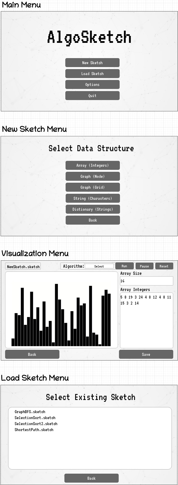

# AlgoSketch
    

## General guidelines:
[Guidelines](doc/Guideline.md)

## UI Prototype:

## Current Progress
The basic functionalities of selection sort and BFS have been implemented graphically with SFML.

### Implemention of Selection Sort

### Implemention of Breadth First Search

